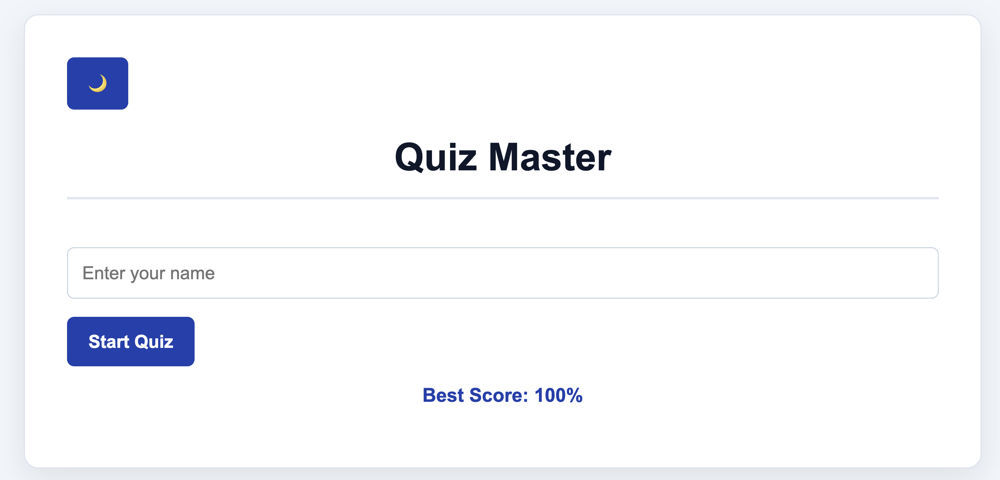

# 🧠 Quiz Master

An interactive browser-based quiz application built with vanilla HTML, CSS, and JavaScript.

## 🚀 Live Demo

https://bhagyapatil486.github.io/2nd-Sem-Project----Quiz-Application/

## 📸 Preview



## ✨ Features

- **Personalized experience** — Enter your name before starting the quiz
- **Instant feedback** — Answers are highlighted correct (green) or wrong (red) immediately
- **Score tracking** — Live score updates as you progress through questions
- **Best score memory** — Your highest score is saved in `localStorage` and displayed on the start screen
- **Dark / Light mode** — Toggle between themes with a single click; preference is remembered across sessions
- **Responsive layout** — Clean, minimal UI that works on all screen sizes

## 🛠️ Tech Stack

| Technology | Usage |
|---|---|
| HTML5 | Structure and layout |
| CSS3 | Styling, dark mode, responsive design |
| JavaScript (ES6) | Quiz logic, DOM manipulation, localStorage |

## 📁 Project Structure

```
Quiz-Application/
├── index.html    # App structure and markup
├── style.css     # Styles and dark mode theming
├── script.js     # Quiz logic and interactivity
└── README.md
```

## ▶️ Getting Started

No installation or build step needed — just open in a browser.

```bash
# Clone the repository
git clone https://github.com/bhagyapatil486/2nd-Sem-Project----Quiz-Application.git

# Open in your browser
open index.html
```

Or simply download the ZIP and open `index.html` directly.

## 🎮 How to Play

1. Enter your name on the start screen and click **Start Quiz**
2. Read each question and select one of the four options
3. Get instant feedback — correct answers turn green, wrong ones turn red
4. Click **Next** to move to the following question
5. View your final score and percentage at the results screen
6. Hit **Play Again** to restart

## 📝 Quiz Topics

The current question set covers core JavaScript and Web Development concepts:

- Browser-side programming languages
- The Document Object Model (DOM)
- Event handling
- Web Storage APIs
- Array methods

## 🤝 Contributors

Thank you to everyone who contributed to this project!

- Bhagyashree Patil ([@bhagyapatil486](https://github.com/bhagyapatil486))
- Uttkarsh Chambiyal ([@Uttkarshchambiyal](https://github.com/Uttkarshchambiyal))
- Sahil Behra ([@sahilbehera1012007-cyber](https://github.com/sahilbehera1012007-cyber))
- Disha Rai ([@disharai123a-oss](https://github.com/disharai123a-oss))
- Abhishek ([@abhishek-d19](https://github.com/abhishek-d19))
- Alok Kumar ([@alokrm2008-a11y](https://github.com/alokrm2008-a11y))

## 📄 License

This project was built as a 2nd Semester academic project.
